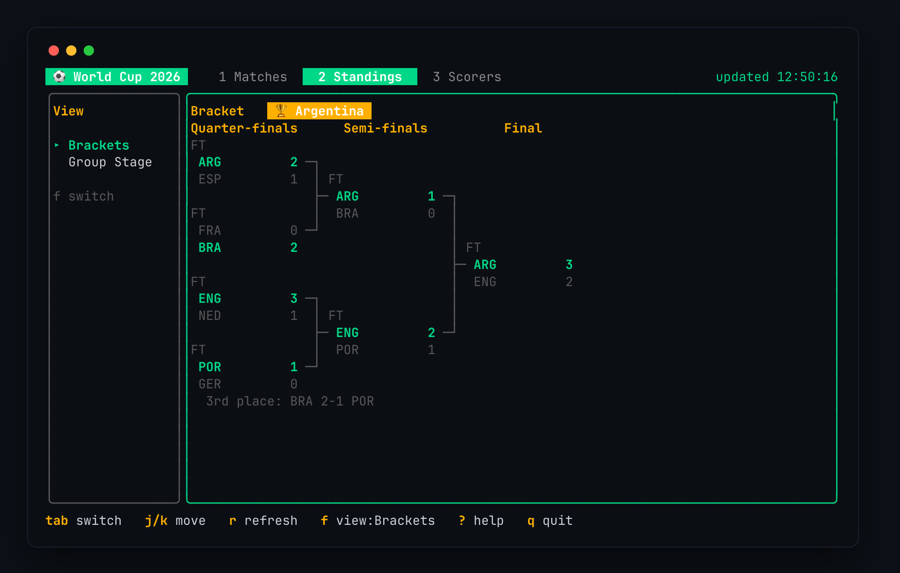
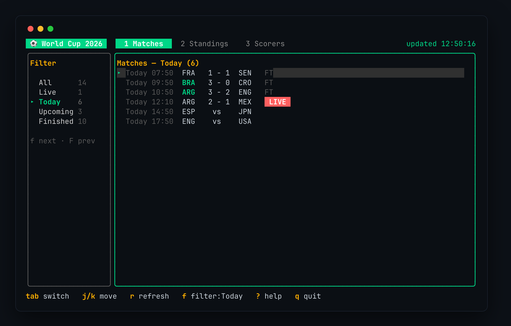
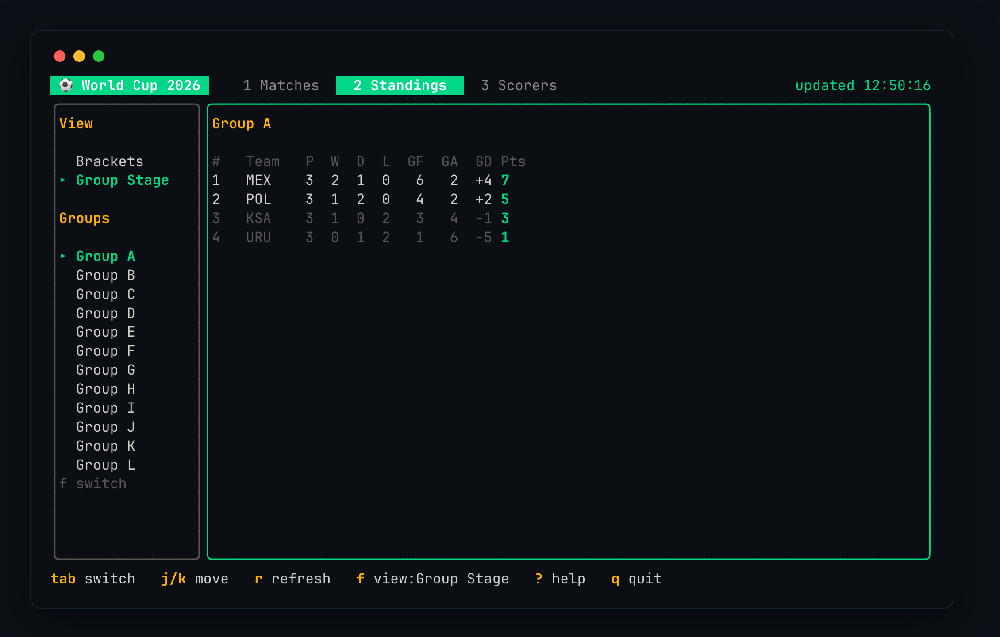
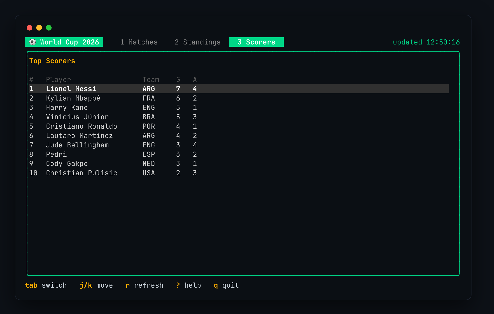

<div align="center">

# ⚽ wc26

**A terminal UI for following the FIFA World Cup 2026** — live scores, fixtures, group standings, and top scorers, right from your shell.

In the spirit of [`lazygit`](https://github.com/jesseduffield/lazygit) and [`yazi`](https://github.com/sxyazi/yazi).

[](https://go.dev/)
[](https://github.com/charmbracelet/bubbletea)
[](LICENSE)



</div>

---

## Features

- 📅 **Matches** — fixtures and live scores, filterable by **All / Live / Today / Upcoming / Finished**, with counts next to each filter and winners highlighted.
- 🔴 **Live updates** — in-play games get a `LIVE` badge and the board auto-refreshes every 30 seconds.
- 🏆 **Standings** — switch the left panel between an ASCII **knockout bracket** (winners highlighted, a champion banner, third-place play-off) and the full **group tables** (P / W / D / L / GF / GA / GD / Pts) with qualification spots highlighted.
- 👟 **Top scorers** — the Golden Boot race with goals and assists.
- ⌨️ **Keyboard-driven** — vim-style navigation, tabs, and filters; no mouse needed.
- 💾 **Rate-limit friendly** — responses are cached on disk, so browsing never burns through the free API tier.

## Screenshots

<p align="center"><b>Matches</b> — fixtures &amp; live scores, filterable</p>
<p align="center"></p>

<p align="center"><b>Standings · Brackets</b> — the knockout tree</p>
<p align="center"></p>

<p align="center"><b>Standings · Group Stage</b> — switch views in the left panel with <code>f</code></p>
<p align="center"></p>

<p align="center"><b>Top Scorers</b> — the Golden Boot race</p>
<p align="center"></p>

## Install

Requires [Go 1.26+](https://go.dev/dl/).

```bash
git clone https://github.com/iliutaadrian/wc26-cli.git
cd wc26
go build -o wc26 .
```

Or install it straight onto your `PATH`:

```bash
go install github.com/iliutaadrian/wc26-cli@latest   # puts `wc26` in $(go env GOPATH)/bin
```

## Setup

`wc26` reads data from [football-data.org](https://www.football-data.org/), which needs a free API token.

1. **Get a token** at <https://www.football-data.org/client/register> (takes a minute).
2. Make it available in any one of these ways:

   ```bash
   export WC_API_TOKEN=your_token                       # environment variable
   # or
   mkdir -p ~/.config/wc26 && echo your_token > ~/.config/wc26/token   # config file
   # or pass it inline:
   ./wc26 --token your_token
   ```

3. Run it:

   ```bash
   ./wc26
   ```

## Keys

| Key | Action |
|-----|--------|
| `1` `2` `3` | jump to Matches / Standings / Scorers |
| `tab` / `h` `l` | switch tabs |
| `j` `k` / `↑` `↓` | move selection |
| `g` / `G` | jump to top / bottom |
| `f` / `F` | Matches: cycle filter · Standings: switch Brackets ⇄ Group Stage |
| `r` | refresh the current tab from the API |
| `?` | toggle help |
| `q` | quit |

## Flags

| Flag | Default | Description |
|------|---------|-------------|
| `--token` | — | API token (overrides env/config) |
| `--cache` | `60s` | how long to reuse cached API responses |

## How it works

The free football-data.org tier allows **10 requests/minute**. `wc26` caches every response on disk
(`~/Library/Caches/wc26` on macOS, `$XDG_CACHE_HOME/wc26` on Linux), so:

- navigating tabs and scrolling never hits the network,
- it only refetches on manual refresh (`r`) or the 30s live auto-refresh while a game is in play,
- and if the API rate-limits or the network drops, it transparently falls back to the last cached copy.

Match times are returned in UTC and rendered in your **local** timezone. The Matches tab opens on
**Today** by default (falling back to **All** on rest days).

## Project structure

```
wc26/
├── main.go                 # flags, token resolution, program bootstrap
├── internal/
│   ├── api/
│   │   ├── client.go       # football-data.org client + disk cache + rate-limit fallback
│   │   └── types.go        # JSON response types
│   └── ui/
│       ├── model.go        # Bubble Tea model, update loop, keybindings
│       ├── views.go        # rendering for Matches / Standings / Scorers + filters
│       ├── bracket.go      # the knockout-bracket layout & renderer
│       └── styles.go       # Lipgloss styles / palette
└── docs/screenshots/       # images used in this README
```

## Built with

- [Bubble Tea](https://github.com/charmbracelet/bubbletea) — the TUI framework
- [Lipgloss](https://github.com/charmbracelet/lipgloss) — styling & layout
- [Bubbles](https://github.com/charmbracelet/bubbles) — spinner component
- Data from [football-data.org](https://www.football-data.org/)

## License

[MIT](LICENSE)
